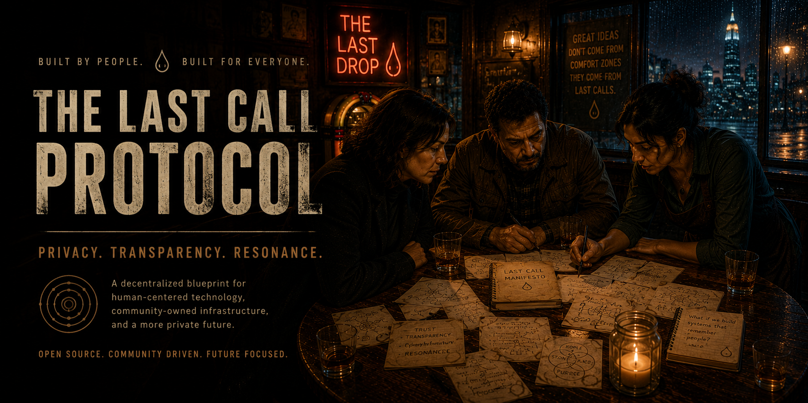
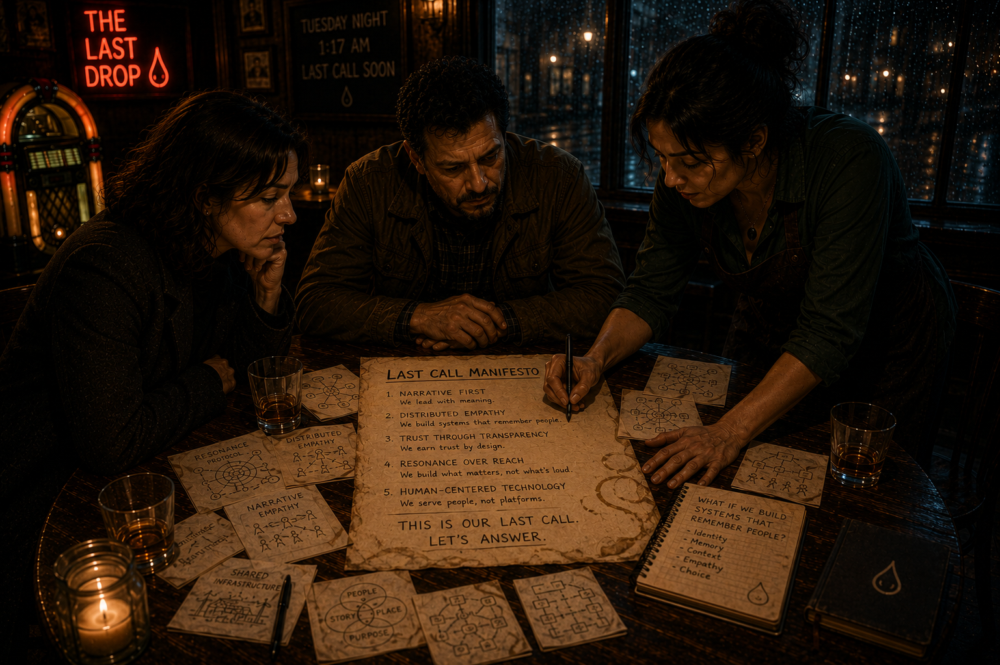

  

# The Last Call Protocol

> "The best ideas for saving the world are often born between the third drink and last call."

**[Visit the landing page](https://ar-fullsend.github.io/the-last-call-protocol/)**

Three new friends met at a bar. By morning, they had a plan to save the world.

This repository documents **The Resonance Protocol**, a framework for human coordination and collective action born from one unforgettable night at **The Last Drop**.

## 🍷 The Night Everything Changed

It was a stormy Tuesday in the city of New Cascade. The power had flickered twice already. At The Last Drop (a dimly lit bar with sticky floors, an ancient jukebox, and a bartender who had heard every story twice) three strangers found themselves at the same corner table.

- **Dr. Elena Voss** had just walked out of her job at a major AI lab. She was tired of building systems that optimized for engagement instead of actually helping people.
- **Marcus Rivera**, a climate infrastructure engineer, had spent the last decade building microgrids in places governments forgot. He was done waiting for policy to catch up with physics.
- **Sofia Patel**, once an investigative journalist, now poured drinks and listened. She knew that the truth rarely spreads through data. It spreads through stories that make people *feel* something.

They started with small talk. Then the drinks got stronger. Then the conversation got dangerous.

By 1:17 AM, napkins were covered in diagrams. By 2:03 AM, they had named it. By last call, they had a manifesto.

## ✨ The Resonance Protocol

The technique they invented isn't a single technology. It's a **living framework** for aligning people and systems toward a healthier world.

### Core Principles

1. **Narrative First**  
   Complex problems must be translated into stories so compelling that three strangers at a bar would drop everything to work on them.

2. **Distributed Empathy**  
   Decision-making systems must include mechanisms that model not just votes or capital, but *lived experience* and care for others.

3. **Regenerative Loops**  
   Every action, project, or protocol should be measured by whether it increases the health of both human communities *and* the living planet.

4. **The Bar Test**  
   If an idea cannot be explained clearly and inspire action from ordinary people after a few drinks, it is not yet ready for the world.

5. **Verifiable Trust**  
   Cryptographic commitments, transparent ledgers, and open-source everything. No black boxes when the stakes are planetary.

### The Three Layers

- **Layer 1: The Spark (Human Connection)**  
  Create spaces and rituals (physical and digital) where unlikely people meet and dream together.

- **Layer 2: The Forge (Co-Creation)**  
  Turn shared stories into concrete, testable protocols and prototypes using multi-agent systems, liquid democracy, and regenerative economics.

- **Layer 3: The Resonance Field (Scale)**  
  Deploy systems that create positive feedback loops, where doing good for the world becomes the rational and economically rewarded path.

## 🚀 Current Status

This is an early-stage, community-driven project. We're building in public:

- The origin story and full narrative
- A living specification of the Resonance Protocol
- Documentation, artwork, and movement materials
- A [Cinematic Bible](docs/CINEMATIC_BIBLE.md) for visual continuity across all artwork

## 🧠 Philosophy

The next breakthrough won't come from a lab, a boardroom, or a government summit.

It will come from bars, kitchens, campfires, and Discord servers, places where people actually talk to each other.

The Resonance Protocol is our attempt to capture that and run with it.

## 🔥 Join the Movement

- Star this repo if the story resonates
- Open issues with your own "bar-born" ideas
- Fork and build your own prototypes
- Tell your friends. Start your own table.

> The world doesn't need more heroes. It needs more tables.

---

**Built with hope, whiskey, and stubborn optimism.**

*This project is dedicated to everyone who has ever stayed past last call talking about how to make things better.*