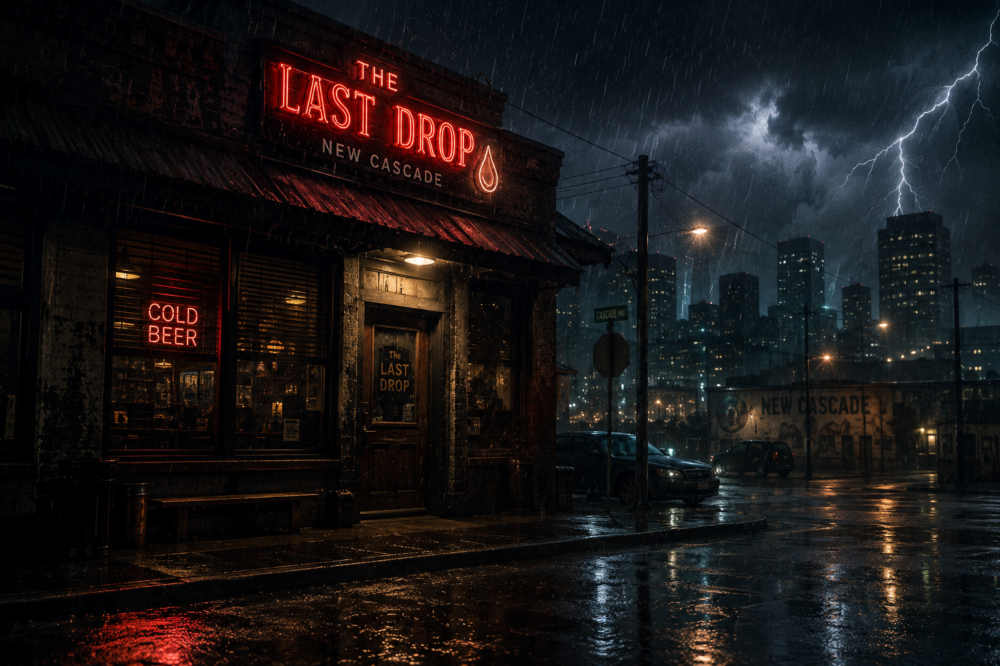
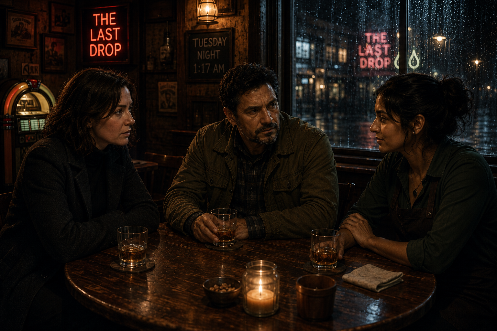
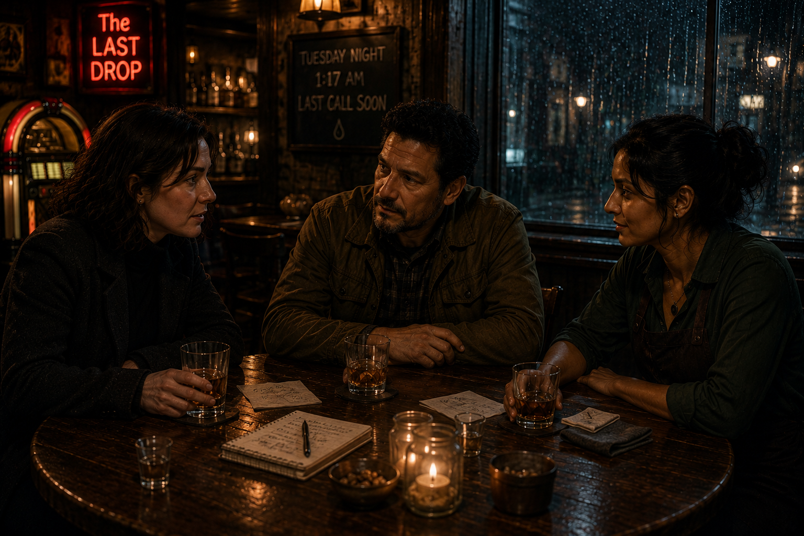
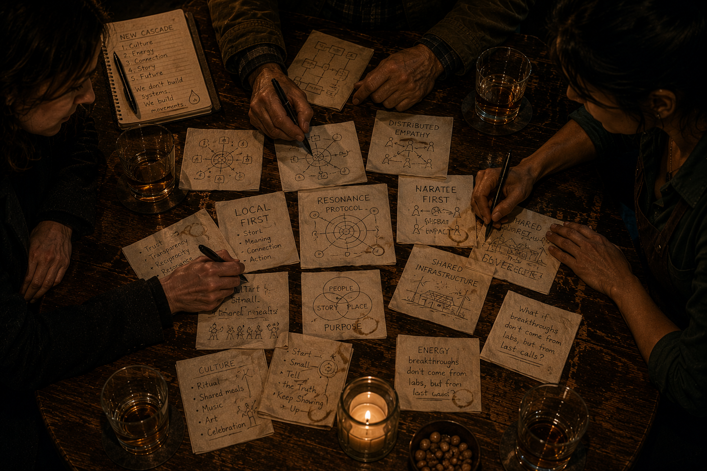
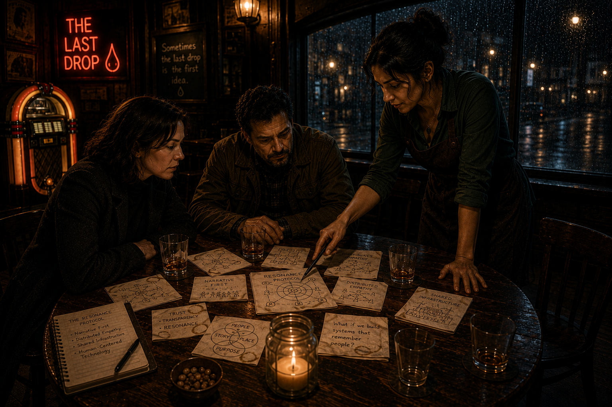
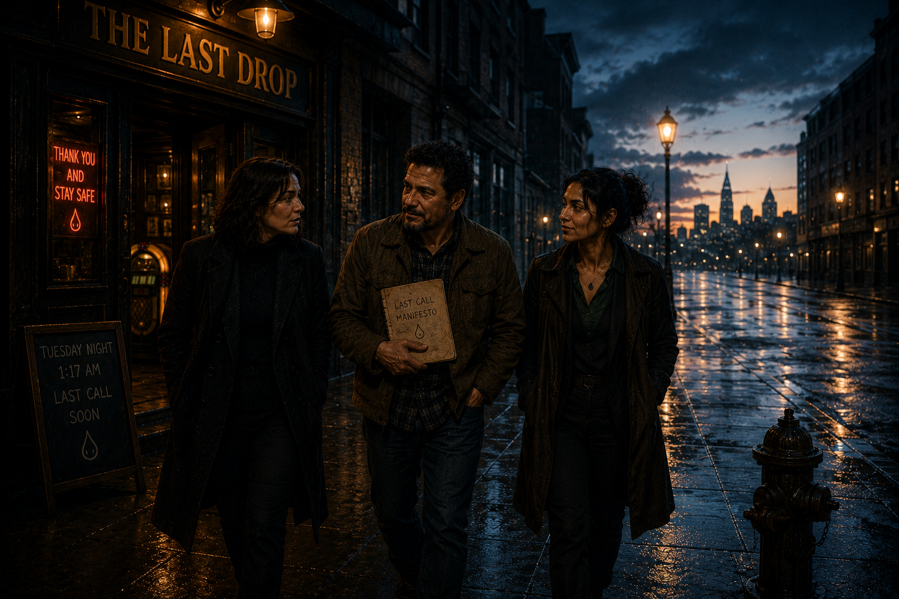
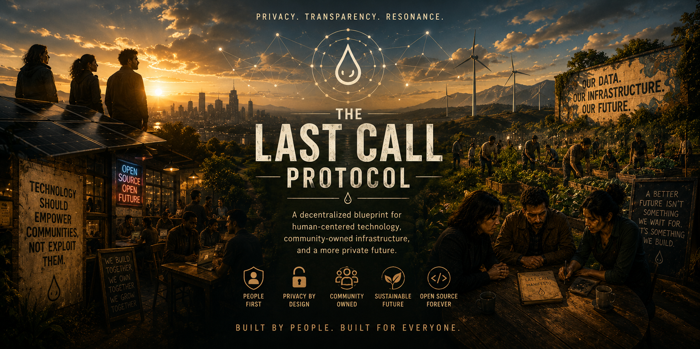

# The Night at The Last Drop

*Tuesday, May 12th, 2026. New Cascade.*

The rain had been falling sideways for hours. Streetlights buzzed and flickered as another blackout moved through the city. Most people had gone home. The sensible ones, anyway.

At The Last Drop, the lights stayed on. Barely. The old generator in the back hummed like an angry cat. The jukebox was playing something by Tom Waits that felt older than the building itself.

## Elena Voss

She sat with her shoulders curled forward, nursing a whiskey neat like it owed her money. Forty-two years old. Recently ex-Principal AI Ethicist at one of the big frontier labs. She had left after her team's sixth internal memo about long-term effects on people was ignored in favor of another capability scaling sprint.

Tonight she wasn't sure if she was mourning her career or celebrating her freedom.

## Marcus Rivera

He took the seat across from her without asking. Mid-50s, sun-worn face, hands that looked like they could fix anything or break anything. He ordered two more whiskeys and slid one across the table.

"You look like someone who just escaped something," he said.

"I did," Elena replied. "You look like someone who's been building things while the rest of us argued about models."

He smiled. "Guilty. Been wiring microgrids in places that don't show up on most maps. Gets lonely when you realize the real problem isn't the panels. It's getting people to want the same future at the same time."

## Sofia Patel

The bartender appeared with a third glass and sat down without ceremony. She'd been listening for twenty minutes while pretending to wipe the same spot on the bar.

"You two are terrible at small talk," she said, pouring herself a small measure. "Also, the power's probably going out again in about forty minutes. So if you've got something worth saying, now's the time."

---

What started as venting quickly became dangerous.

Elena ordered a second drink and started talking about alignment -- not AI alignment, the kind that had exhausted her, but something older. How every civilization runs on a story about who matters and who doesn't. How the current story had stopped working and nobody in power wanted to admit it.

"So you're saying we're stuck because of our mythology," Marcus said. Not dismissive. Thinking it through.

"I'm saying the infrastructure is downstream of the story. Always has been."

He turned his glass. "I've been building solar microgrids in places the grid forgot. Good work. Real work. But every installation I do, I feel it -- the physics is solved, the hardware exists. What's missing is twenty people agreeing they want the same future."

"Because they're running different stories," Elena said.

"Right."

Sofia set down her rag. "You two are describing the problem like it's a design challenge. It's not a design challenge."

They looked at her.

"I spent six years chasing corruption stories. Good ones. True ones. They bounced. Facts bounce off people. You know what doesn't bounce?" She leaned forward. "A story where someone feels seen. That rewires them. The problem is we've let the worst storytellers own the biggest stages."

"So you write better stories," Marcus said.

"No -- you create the conditions where people tell their own. Where the right strangers end up at the same table." She gestured at the bar around them. "Like this."

Elena grabbed a napkin. "What if the table is actually the unit? Not the platform, not the app. The table."

Marcus pulled the napkin toward him and started drawing -- a rough grid, power sources, load centers, nodes. Then he stopped and looked at it. "A microgrid is a table," he said. "It's a group of things that agreed to share."

They ordered another round.

By the time the lights dimmed the second time, the napkins were covered. Elena's were full of loops and arrows, the word *resonance* circled twice. Marcus had mapped something that looked like both a power grid and a neighborhood. Sofia had written a single question at the top of hers and spent an hour working down from it: *What would have to be true for this to be the obvious thing to do?*

At 1:52 AM, Elena looked at the word she'd been circling and said:

"What if resonance is the infrastructure? When a story hits the right frequency in enough people at once, something actually changes. What if we built for that deliberately?"

Marcus nodded slowly. "The Resonance Protocol."

Sofia raised her glass. They clinked. The lights went out completely thirty seconds later.

They kept talking in the dark for another hour.

---

They didn't solve everything. They didn't even solve one thing completely.

But they wanted the same thing at the same time, which is rarer than it sounds.

And they wrote it down.

The rest is what this repository is for.

---

*The Last Drop is still there. The table is still in the corner. The napkins are long gone.*

